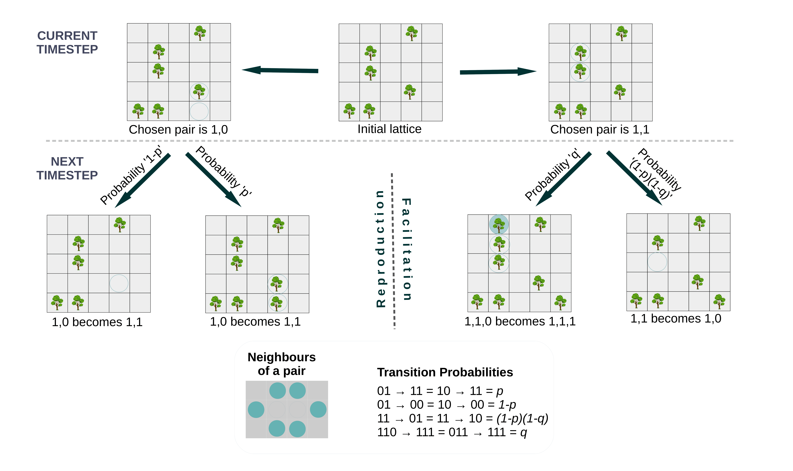
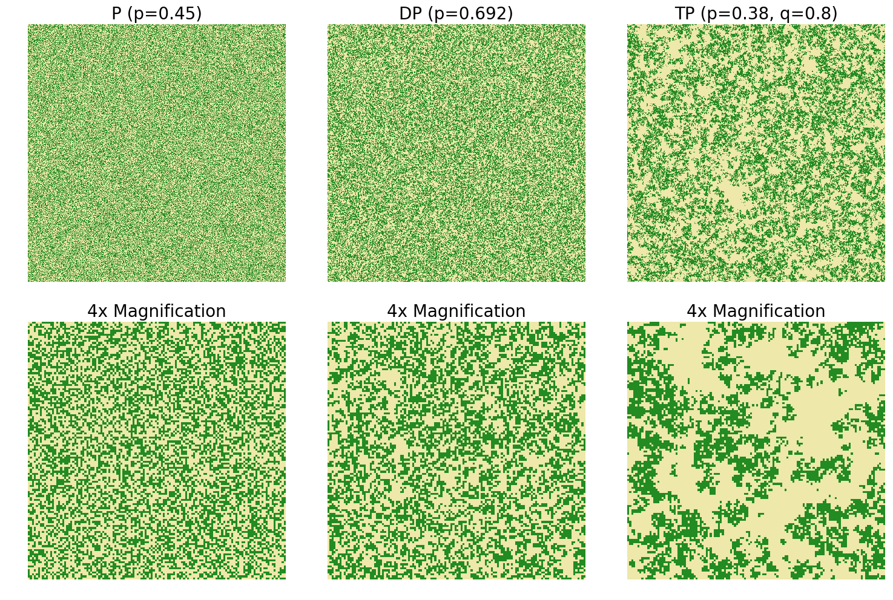

# Cluster Dynamics 
Simulate and analyze cellular automata models of vegetation dynamics

Currently, this repository implements three ecologically inspired cellular automata models that are caricatures of real vegetation dynamics. The aim is to capture some of the most important interactions between individual plants namely competition and facilitation. Note that competition and facilitation are really umbrella terms for majorly complicated and context dependent processes. The models are described next. 

## Null Percolation (P)

In this model we have two possible states - vegetated or barren - for a given site on an square lattice of side length L, the former represented by 1 and the latter by 0. The
transition rules are:

A single parameter p taking values from 0 to 1 governs the model. Both birth and death are frequency-dependent.

## Directed Percolation (DP)

This is a discrete formulation of the contact process. Like the previous model, there are two possible states - vegetated or barren - for a given site on the lattice. Unlike the previous model, this model has facilitative interactions or equivalently positive feedback. The transition rules are:

We have a single parameter p for this model - it takes values from 0 to 1. Birth at barren site 0 happens in a density-dependent manner because it depends on the
concentration of vegetated sites (1) in its neighbourhood: this model has facilitation. Death of a vegetated site to give a barren site however is only frequency
dependent. We use a von-Newmann neighbourhood of radius 1, hence facilitation is only short-range. 

## Thick Percolation (TP) 

Unlike the previous models, this one has two parameters. The additional tunable parameter q controls the strength of facilitative interactions among individual plants. It is a modified version of Lubeck (2006). The transition rules are:

The third and fourth rule materialize enhanced birth probability and diminished death probability in the presence of other plants. The figure below gives an illustrations of these update rules (credits: Sumithra Sankaran). Note that this model degenerates to DP when q is set to zero. For all these models, we use an asynchronous update scheme and periodic boundary conditions. 

Given below are snapshots from these three models. The first row shows 512x512 lattices. The second row gives a magnified view of the same. Green is vegetation. Find the raw data for the frames along with a Jupyter notebook to visualize them in the `snapshots` folder. Check the `simulations` folder for the implementation of these models and to see some of the things we have studied. All data required to generate the figures in `figures` folder can be found [here](https://drive.google.com/drive/folders/1GnC9Br5dvMs0IXgr4zMC3KUgRXtmjpB2?usp=sharing). The figures can be generated using the notebooks in `analysis` folder.  
 

### References

1. Sankaran, S., Majumder, S., Viswanathan, A., & Guttal, V. (2019). Clustering and correlations: Inferring resilience from spatial patterns in ecosystems. Methods in Ecology and Evolution, 10(12), 2079-2089.
2. Lübeck, S. (2006). Tricritical directed percolation. Journal of statistical physics, 123(1), 193-221.
3. Seri, E., Maruvka, Y. E., & Shnerb, N. M. (2012). Neutral dynamics and cluster statistics in a tropical forest. The American Naturalist, 180(6), E161-E173.
